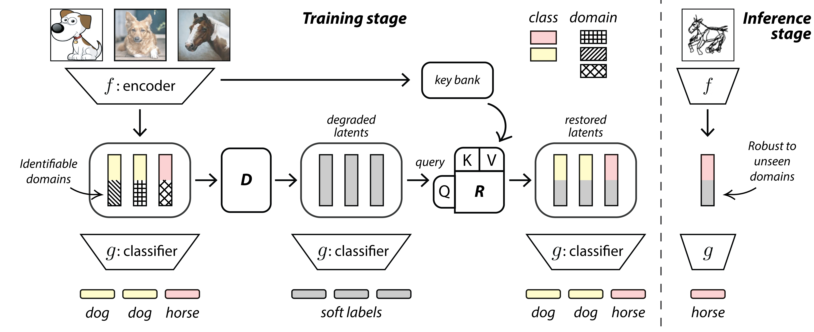

# LatentDR
PyTorch implementation of [LatentDR: Improving Model Generalization Through Sample-Aware Latent Degradation and Restoration](https://arxiv.org/pdf/2308.14596.pdf), WACV 2024

[Ran Liu](https://ranliu98.github.io/), Sahil Khose, [Jingyun Xiao](https://scholar.google.com/citations?user=LEHq9a8AAAAJ&hl=en), Lakshmi Sathidevi, Keerthan Ramnath, [Zsolt Kira](https://faculty.cc.gatech.edu/~zk15/), [Eva L Dyer](https://dyerlab.gatech.edu/people/pi-profile/)

## Introduction

Despite significant advances in deep learning, models often struggle to generalize well to new, unseen domains, especially when training data is limited. 

To address this challenge, we propose a novel approach for distribution-aware latent augmentation that leverages the relationships across samples to guide the augmentation procedure.

  

 

Our approach first **degrades** the samples stochastically in the latent space, mapping them to augmented labels, and then **restores** the samples from their corrupted versions during training. 
This process confuses the classifier
in the degradation step and restores the overall class distribution of the original samples, promoting diverse intraclass/cross-domain variability.
We extensively evaluate our
approach on a diverse set of datasets and tasks, including domain generalization benchmarks and medical imaging datasets with strong domain shift, where we show
our approach achieves significant improvements over existing methods for latent space augmentation.

